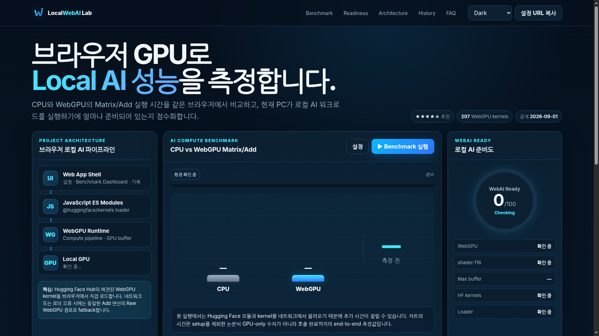

# LocalWebAI Lab

브라우저의 WebGPU를 이용해 CPU/GPU Matrix/Add 성능을 비교하고 현재 PC의 Local AI 실행 가능성을 점수화하는 **GitHub Pages용 완성형 정적 웹서비스**입니다. Hugging Face가 2026-09-01 공개한 `@huggingface/kernels` preview loader를 우선 사용해 `webgpu-kernels/ai.onnx.Add`를 Hub에서 직접 로드합니다.

## Preview

첫 화면에서 WebGPU 지원 여부와 GPU 정보를 확인하고 Matrix 크기·워밍업·반복 횟수를 설정한 뒤 실제 CPU Worker와 WebGPU 연산을 실행합니다. Hugging Face loader/kernel 로딩이 실패하면 동일한 Add 연산을 Raw WebGPU compute shader로 실행합니다.



## Features

- CPU Worker vs WebGPU Matrix/Add 실제 benchmark
- `@huggingface/kernels@preview` + `ai.onnx.Add` Hub kernel 실행
- Raw WebGPU fallback
- WebAI Ready 0–100 휴리스틱 점수
- GPU adapter / shader-f16 / buffer limit 상태 표시
- **Hugging Face WebGPU 207개 kernel 전체 정적 catalog**
- `localwebai-complete.json` 전체 데이터 단일 다운로드 파일
- Kernel 검색 / namespace filter / category filter / pagination
- Hugging Face 공개 Apple M4 reference benchmark 데이터 표시
- Quick / Balanced / Large / Stress benchmark preset
- 데이터 manifest + JSON Schema + source provenance
- Benchmark 설정/최근 20개 기록 LocalStorage 저장
- 실측 기록 JSON export / 삭제
- Query string 기반 설정 공유
- Dark / Light / System theme 저장
- Responsive layout (320px ~ 1440px+)
- PWA manifest + static data offline cache
- SEO / Open Graph / Twitter Card / JSON-LD
- favicon / app icons / OG image / repository social preview
- 커스텀 404
- GitHub Actions → GitHub Pages 자동 배포

## Static Data Store

이 버전부터 서비스 데이터가 `site/data/`에 완전히 분리되어 있습니다. 별도 DB가 필요하지 않으며 Git commit 자체가 데이터 변경 이력입니다.

```text
site/data/
├─ data-manifest.json
├─ localwebai-complete.json     # 전체 데이터 단일 파일
├─ project.json
├─ kernel-catalog.json          # 207 kernels
├─ kernel-catalog.csv           # 207 kernels CSV export
├─ benchmark-presets.json
├─ readiness-rubric.json
├─ reference-benchmarks.json
├─ compatibility.json
├─ hardware-profiles.json
├─ roadmap.json
├─ faq.json
├─ sources.json
└─ schemas/
   ├─ benchmark-result.schema.json
   └─ kernel-catalog.schema.json
```

자세한 데이터 정의와 provenance는 [`DATA.md`](DATA.md)를 참고하세요.

### 데이터 출처 구분

- `kernel-catalog.json`: Hugging Face `webgpu-kernels` 조직의 공개 207개 repository 이름을 2026-09-07 기준 검증한 snapshot입니다.
- `reference-benchmarks.json`: Hugging Face 공식 2026-09-01 글의 Apple M4 비교 수치를 기록합니다.
- `category`, WebAI Ready 점수, preset, roadmap 등은 LocalWebAI Lab 자체 데이터입니다.
- `hardware-profiles.json`은 UI 테스트용 합성 데이터이며 실제 GPU 성능 정보가 아닙니다.

## Tech Stack

- HTML5 / CSS3
- JavaScript ES Modules
- Static JSON Data Store
- Web Workers
- WebGPU / WGSL
- Hugging Face `@huggingface/kernels@preview` (runtime ESM CDN loading)
- LocalStorage
- Service Worker / PWA
- GitHub Pages / GitHub Actions

별도 framework/runtime dependency를 두지 않아 GitHub Pages 하위 경로에서도 asset과 데이터 URL이 단순하고 안정적입니다.

## Project Structure

```text
/
├─ site/
│  ├─ assets/
│  ├─ data/                     # 전체 공개 데이터
│  ├─ js/
│  │  ├─ app.js
│  │  ├─ benchmark.js
│  │  ├─ config.js
│  │  ├─ data.js               # JSON loader
│  │  ├─ readiness.js
│  │  └─ storage.js
│  ├─ workers/cpu.worker.js
│  ├─ index.html
│  ├─ 404.html
│  ├─ styles.css
│  ├─ service-worker.js
│  ├─ manifest.webmanifest
│  ├─ robots.txt
│  └─ sitemap.xml
├─ scripts/
│  ├─ build.mjs
│  ├─ check.mjs
│  └─ dev.mjs
├─ docs/
├─ .github/workflows/deploy.yml
├─ DATA.md
├─ package.json
└─ README.md
```

## Local Development

```bash
npm install
npm run dev
```

브라우저에서 `http://127.0.0.1:4173/`를 엽니다.

## Build & Validation

```bash
npm run build
npm run check
```

`npm run check`는 필수 asset 외에도 **207 kernel count, 중복 ID, JSON parse, 100점 rubric 합계, manifest 파일 존재 여부**를 검사합니다.

배포 URL을 canonical/OG 메타데이터에 넣으려면:

```bash
SITE_URL=https://USERNAME.github.io/REPOSITORY/ npm run build
```

## GitHub Pages Deployment

1. 새 GitHub Repository를 만들고 프로젝트 전체를 push합니다.
2. 기본 branch는 `main`으로 둡니다.
3. Repository → **Settings → Pages** → Source를 **GitHub Actions**로 선택합니다.
4. `main`에 push하면 `.github/workflows/deploy.yml`이 build/check 후 `dist/`를 배포합니다.
5. 일반 project site와 `USERNAME.github.io` user site를 workflow가 구분합니다.
6. Custom domain 사용 시 Actions Variable `SITE_URL`에 `https://example.com/` 형태를 등록합니다.

```bash
git init
git add .
git commit -m "feat: launch LocalWebAI Lab"
git branch -M main
git remote add origin https://github.com/USERNAME/REPOSITORY.git
git push -u origin main
```

## Configuration

- `site/js/config.js`: runtime 기본값, Hugging Face ESM endpoint
- `site/data/benchmark-presets.json`: benchmark preset/limit
- `site/data/readiness-rubric.json`: WebAI Ready 점수 정의
- `site/data/project.json`: 서비스 문구/아이디어 metadata
- `site/data/roadmap.json`, `faq.json`: 화면 콘텐츠

## Benchmark Notes

LocalWebAI Lab은 앱이 실제 호출 완료까지 기다린 **end-to-end 시간**을 표시합니다. Hugging Face 공식 소개 글의 reference benchmark는 setup·upload·readback 등을 제외한 GPU-work timing이므로 직접 동일 수치로 비교하면 안 됩니다.

`@huggingface/kernels`는 preview 채널이므로 API/CDN resolution이 바뀔 수 있습니다. loader/kernel 실패 시 Raw WebGPU fallback으로 측정을 계속하고 실패 사유를 화면에 표시합니다.

## Custom Domain

Repository Settings → Pages에서 도메인을 입력하고 DNS/HTTPS를 구성합니다. 필요하면 `site/CNAME`에 도메인을 한 줄로 추가하고 Actions의 `SITE_URL`도 같은 주소로 설정합니다.

## License

LocalWebAI Lab 소스는 MIT입니다. Hugging Face Hub의 개별 kernel은 upstream repository 라이선스를 따르며, 초기 207개 WebGPU kernel collection은 공식 발표 기준 Apache-2.0입니다.

## GitHub Repository Social Preview

Repository → **Settings → General → Social preview**에서 `site/assets/social-preview.png`(1280×640)를 업로드할 수 있습니다.
